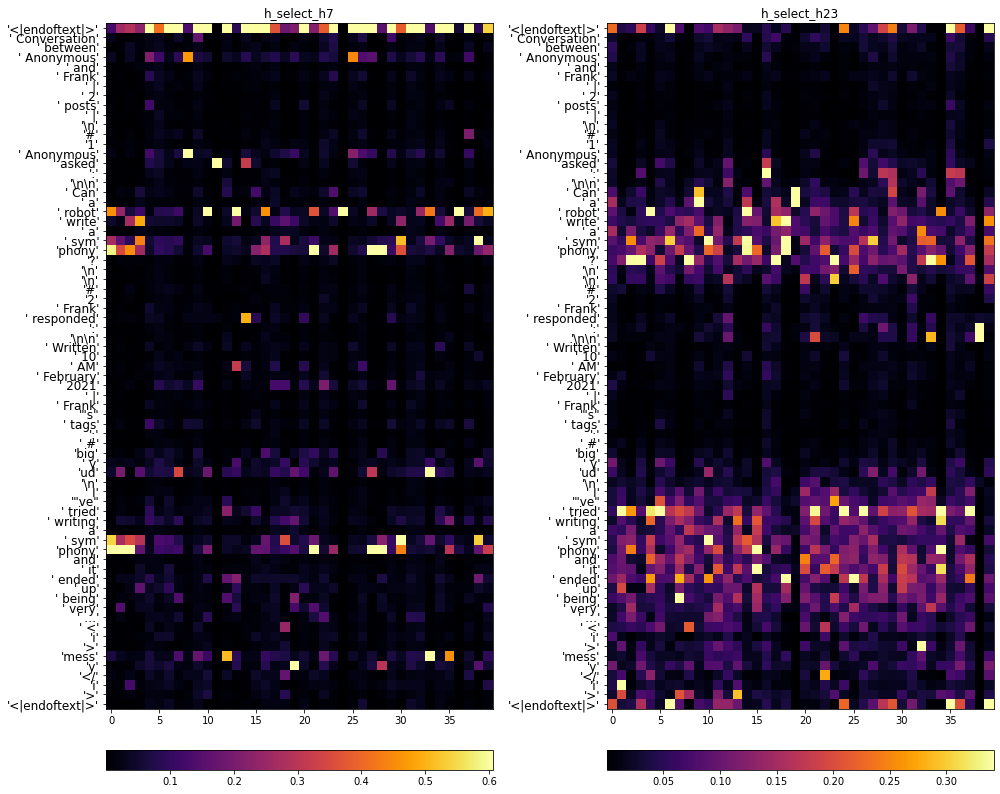

## Visualizations

Directory for sharing visualizations.

Exists only on a non-default branch `visualizations`, because transfering images can be slow and I want cloning from `main` to be fast.

### Subdirectories

#### Selector model internals: `selector_attention/`

These images show where the attention block in the selector model is looking.  Many different versions of the selector model are visualized here.

##### Reading the plots

The plots show what the attention blocks of the selector are looking at, when shown a post that the generator has written.  For details on what this means, see "Selector model architecture" below.

A typical example is shown below:

The two panes correspond to the two attention blocks, which look at layers 8 and 24 of the generator.  (They are labeled `h_select_h7` and `h_select_h23` respectively.)

The token sequence runs along the vertical axis from top down.  Input tokens are printed to the left.

(Note that the higher up you go in GPT-2's layers, the less you should assume that the activation of each position corresponds in a simple way to the _input_ token at that position.  In layer layers, it [mostly encodes GPT-2's prediction for the _next_ token.](https://www.lesswrong.com/posts/AcKRB8wDpdaN6v6ru/interpreting-gpt-the-logit-lens))

The horizontal axis within each pane indexes attention heads.  In this example, there are 40 heads per attention block.  The color in each cell shows how much a given head is "looking at" a given position, on a scale from 0 to 1.  (Check the colorbars for the meaning of different colors in each pane.)

This is a limited window into what the selector is doing.  It doesn't quantify what *information* it uses from each position, only which positions are being used by which heads.  It also ignores the MLP block.  However, I do find these images somewhat informative about broad patterns.

##### Selector model architecture

The selector model has this structure:

- It is a transfer learning model uses activations from the (frozen) generator model as inputs to a task-specific model head.
  - That is, it is a "feature extraction" model in the sense of [Peters et al, "To Tune or Not to Tune?"](https://arxiv.org/pdf/1903.05987.pdf).
  - Transfer learning with ELMo is probably the most widely familiar instance of this type of model in NLP.  Here, the generator (finetuned GPT-2) plays the role of the pretrained BiLSTM in ELMo.
- The "features" extracted are the hidden states of the generator at layers 8 and 24 (of 48 layers total).
- These features are the input of the task-specific selector head, which consists of
  - Two attention blocks, one for each of the two hidden state inputs.
    - Each block's input is an array of shape `(sequence length, n_embed)`.  Here `n_embed` is 1600.
    - These blocks are similar to the attention blocks inside GPT-2, except:
      - Each block's output at the final token of the sequence is treated as a fixed-length embedding vector for the entire sequence.  So, each block outputs a vector of shape `(n_embed,)`.  (Contrast with attention blocks inside GPT-2, which output one such vector _per position_.)
      - The blocks do not use residual connections to their inputs.
      - The number of heads is larger (typically 40, vs. 25 inside GPT-2).
  - A concatenation step, converting the two attention outputs of shape `(n_embed,)` to a single vector of shape `(2*n_embed,)`.
  - A residual MLP block with gelu activation, similar to the MLP blocks inside GPT-2.  The aspect ratio is smaller than inside GPT-2 (typically 3).  The output shape is again `(2*n_embed,)`.
  - A linear-softmax layer projecting its `(2*n_embed,)` input to 2 logits, which are softmaxed to a single probability.

##### File names

File names follow the pattern

`example_{NAME}_ar_{GENERATOR_VERSION}_selector_{SELECTOR_VERSION}.png`

where

- `NAME` is a name identifying the post being visualized.
- `GENERATOR_VERSION` is the version number of the generator model, which the selector "sits on top of."
  - As of this writing, `v10` is the latest version.
- `SELECTOR_VERSION` is the version number of the selector model.
  - These numbers reset when `GENERATOR_VERSION` increments.   For example:
    - `ar_v9_1_selector_v1` is the first selector trained on top of generator `v9_1`.  
    - `ar_v10_selector_v1` is the first selector trained on top of generator `v10`.  

### TODO

- Add train/val loss and noise scale plots from generator training
- Add selector evaluation plots
- Add long-term / counterfactual mood graphs
